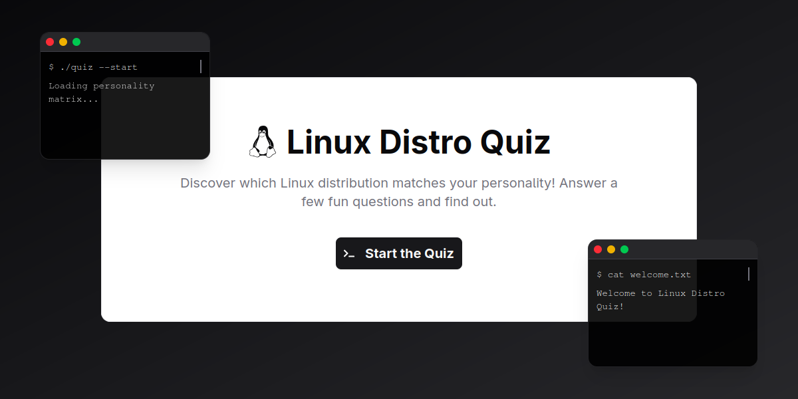

# Linux Distro Personality Quiz



Discover which Linux distribution matches your personality! This fun, interactive quiz helps you find your perfect Linux distro based on your preferences and personality traits. Built with React and TypeScript, styled with Tailwind CSS, and animated with Framer Motion.

[](https://chenxing-dev.github.io/linux-distro-quiz/)
[](https://opensource.org/licenses/MIT)

## Features

- 🐧 **Interactive Personality Quiz**: Answer 10 questions to discover your Linux distro personality
- 🎨 **Terminal-themed UI**: Terminal-themed interface and aesthetics  
- 🚀 **Animated Transitions**: Smooth animations between screens and questions
- 📱 **Fully Responsive**: Works on mobile, tablet, and desktop
- 💾 **Personalized Results**: Detailed distro match with personality insights

## Technologies Used

- **Frontend**: React, TypeScript
- **Styling**: Tailwind CSS
- **Animations**: Framer Motion
- **Icons**: React Icons
- **Build Tool**: Vite

## Installation

1. Clone the repository:
```bash
git clone https://github.com/chenxing-dev/linux-distro-quiz.git
cd linux-distro-quiz
```

2. Install dependencies:
```bash
npm install
```

3. Start the development server:
```bash
npm run dev
```

## Project Structure

```
src/
├── components/
│   ├── WelcomeScreen.tsx      # Welcome screen with Tux animation
│   ├── QuizFlow.tsx           # Quiz questions and navigation
│   └── ResultScreen.tsx       # Result display with distro match
├── data/
│   ├── distros.ts             # Distro database
│   └── questions.ts           # Quiz questions
├── App.tsx                    # Main application component
└── main.tsx                   # Entry point
```

## Screenshots

### Quiz Flow


### Result Screen


## Contributing

Contributions are welcome! Here's how you can help:

1. **Add More Distros**: Expand our database with additional Linux distributions
2. **Improve Questions**: Add more personality-based questions
3. **Enhance UI**: Improve the design and animations

To contribute:
1. Fork the repository
2. Create your feature branch (`git checkout -b feature/amazing-feature`)
3. Commit your changes (`git commit -m 'Add some amazing feature'`)
4. Push to the branch (`git push origin feature/amazing-feature`)
5. Open a Pull Request

## License

This project is licensed under the MIT License - see the [LICENSE](LICENSE) file for details.
